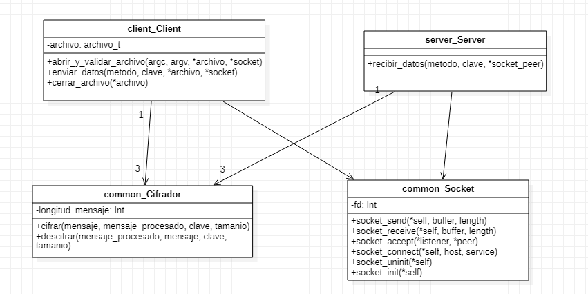

# Trabajo Practico 1

*Nombre*: Damian Ganopolsky  
*Padrón*: 101.168  
*Repositorio*: https://github.com/DamianGanopolsky/TrabajoPractico1TDP

## Introducción

En el presente trabajo se tuvo como principal objetivo poner en practica los nuevos conocimientos adquiridos sobre el uso y manejo de sockets. Ademas, se busco encapsular los distintos bloques del programa en TDAs, y tambien, hacer un buen uso de los recursos y liberarlos cuando sea necesario, entre otras cosas.  

## Descripcion de la resolución

Un detalle importante de la resolucion que vale la pena desarrollar es que el TP lo fui haciendo de a bloques. Es decir, de antemano se sabia que los bloques mas importantes y largos del trabajo iban a ser los distintos cifradores y el socket. Es por esto, que al principio los hice por separado, por un lado, esto sirvio para poder hacerles pruebas particulares a cada uno de los bloques, y por el otro tambien sirvio para reducir el acoplamiento del programa. Finalmente, se consiguio tener a los 3 cifradores y al socket sin que sepan la existencia el uno con el otro, pudiendo asi reutilizarlos en el futuro para otros fines.  

**Dificultad:Enviado de datos al servidor**  
Desde el inicio de la resolucion del trabajo, se priorizo el manejo del Stack por sobre el Heap a diferencia de materias anteriores. Es por esto que un gran problema que me encontre en el trabajo fue como ir enviando los distintos chunks del mensaje completo sin hacer uso del heap. Para realizar esto se fue teniendo en cuenta el tamaño del buffer leido del archivo de entrada, y si este era de 64(maximo tamaño del buffer), se generaba un vector de tipo 'unsigned char' de ese tamaño. Este vector luego es procesado por el cifrador correspondiente y se envia hacia el servidor usando el TDA socket.  
El problema fue el caso del ultimo chunk leido del archivo, ya que este en general es de un tamaño menor a 64, y no se puede saber de antemano cual va a ser su tamaño, es por esto que en este caso se reservo la memoria necesaria en el heap para el tamaño de este ultimo vector. Al solo reservarse memoria para un vector de menos de 64 posiciones en todo el programa, se puede decir que el programa se apoyo bastante en el stack.  
Vale aclarar que en los distintos TDAs programados no se hizo uso de memoria dinamica al inicializarlos para cumplir con los contratos de los mismos.

## Diagrama de clases

En este diagrama de clases se puede notar que tanto del lado del servidor como del lado del cliente existe una clase que se encarga de enviar los datos o de recibir los mismos. Ambas clases hacen uso de bloques comunes de bajo nivel los cuales actuan como cajas negras, estos bloques vendrian a ser el TDA socket, y los TDAs Cesar, Vigenere y RC4.   
Una aclaracion importante es que la clase "Common_Cifrador" es hipotetica, en la practica se encuentran cada una de las clases de los cifradores, se diagramo esta clase con el fin de simplificar el mismo.  

## Diagrama de secuencia

En este diagrama de secuencias se puede ver a gran escala como es el procedimiento mas importante realizado del lado del cliente, el cual es enviar un mensaje dado. El actor en este caso vendria a ser el archivo client_main.c al enviarle el mensaje "enviar_datos" a client. Tambien, se puede ver como se van delegando las distintas responsabilidades para poder hacer el envio completo del mensaje.
